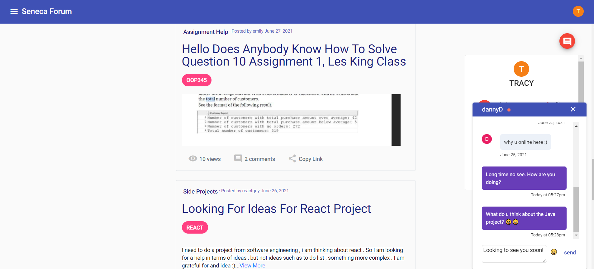

<h3 align="center">SenecaForum · <a href = "http://senecaforum.s3-website.us-east-2.amazonaws.com">Live Demo</a></h3>


<!-- TABLE OF CONTENTS -->
<details open="open">
  <summary>Table of Contents</summary>
  <ol>
    <li>
      <a href="#about-the-project">About The Project</a>
      <ul>
        <li><a href="#built-with">Built With</a></li>
        <li><a href="#built-with">Features</a></li>
      </ul>
    </li>
    <li>
      <a href="#getting-started">Getting Started</a>
    </li>
    <li><a href="#usage">Usage</a></li>
  </ol>
</details>


<!-- ABOUT THE PROJECT -->
## About The Project



This project is a forum for Seneca students to chat with each other, post questions, comment to other's posts, search and filter posts by keywords. In addition, there's an admin console to manage all users' posts.

### Built With

* Java 11
* Spring Boot 5.1.3
* StompJs
* WebSocket
* Angular 11
* CKEditor 5
* Deployed backend on Google Cloud, frontend on AWS S3
* Unit Testing with JUnit

### Features
* Display hot posts which have the most views


* Forum where posts are group by topics


* Filter posts based on multiple conditions. This feature is built by creating complex SQL queries (a combination of Union, Join, and alias table).


* Each user and admin can perform CRUD (Create, Read, Update, Delete) on posts. User can add images to a post and flexibly resize the images.


* Users can chat with each other, view history messages and other's status (online, offline). This feature is built by using WebSocket.


* Users can get notification when there are new messages.


* Apply authentication filter only to certain routes. For example: Only users can edit and delete their own posts or only admin is authorized to visit admin dashboard. This feature is built with Spring Security.


* Remember me - if users login and select "remember me" - they don't have to login every time they visit the website within 15 days. Otherwise, users will be out of the session and have to re-login every 15 mins.


## Installation

* Clone the repo (frontend & backend)
   ```sh
  git clone https://github.com/trangntt-016/senecaforum-frontend.git
   ```
  ```sh
  git clone https://github.com/trangntt-016/seneca-forum-backend.git
   ```
* Frontend
   ```sh
   npm install
   ```
  ```sh
  ng serve
   ```
* Backend
   ```sh
  cd src/main/java/com/seneca/senecaforum
   ```
  ```sh
  Right click on SenecaForumApplication.java -> Run
   ```

## Usage
* Visit website: http://senecaforum.s3-website.us-east-2.amazonaws.com


* User's feature: View, Create, Update, Delete, Search, Filter Posts, chat with others


* Admin's feature: login as "admin@gmail.com", pass "admin123456". You can play with the posts by going to the admin's dashboard and changing the post's status as "DECLINED" or "PENDING". The posts won't be deleted but won't show up on the website.

